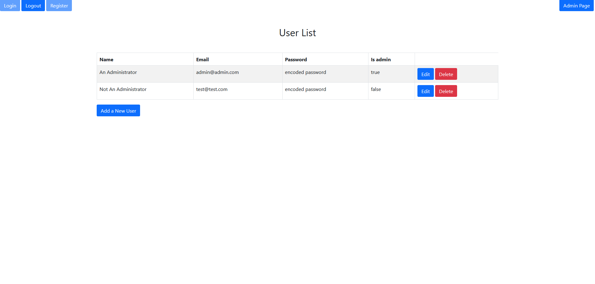
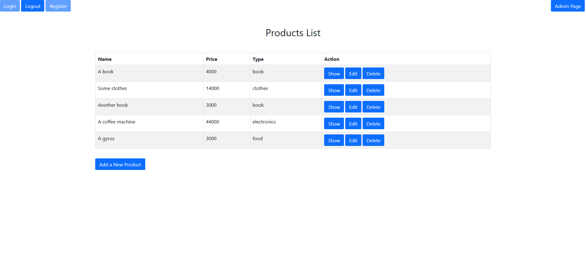
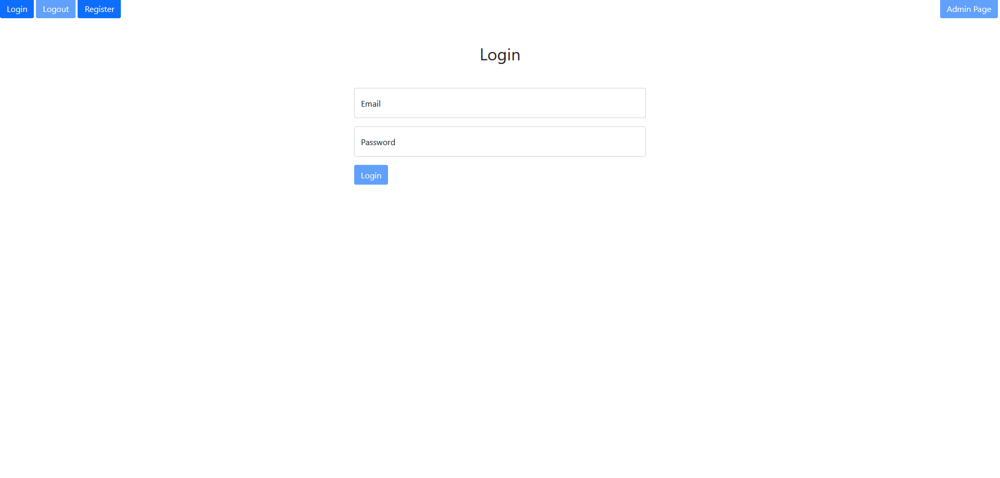
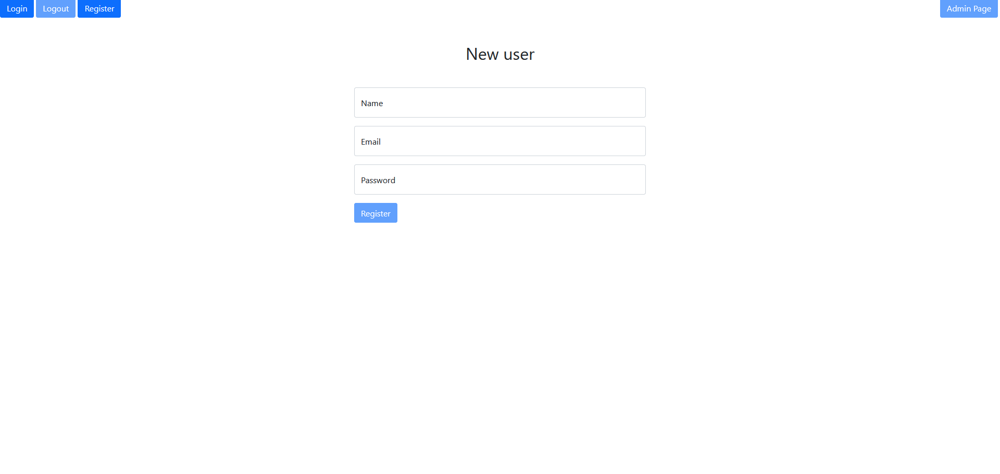

# Programrendszerek Fejlesztése Beadandó

## How To Run

Set the [Atlas URI connection string](https://docs.atlas.mongodb.com/getting-started/) as a parameter in `server/.env`. I sent the URI which you may use. Alternatively you can use your own.

On first run you should set `SHOULD_BOOTSTRAP = true` to populate database

The admin user is admin@admin.com, with the password: adminadmin

The regular user is test@test.com, with the password: testtesttest

Set the name of the database you want to use, it can be whatever, would recommend something unique, like a random string of characters or numbers

Install dependencies

```
npm install
```

Start the server and client applications by going into `/server` and `/client` and in both directories running:
```
npm start
```

When both applications are built and running, open your browser on http://localhost:3000/.

## When it is inside

The project has the following main pages:

The admin page, where you can add, delete, and edit users



The products page, where you can add, delete, edit and show the details of products, if you are an admin, or just add and show if you are a registered user, or just show if you are an unregistered user



Login and register pages

